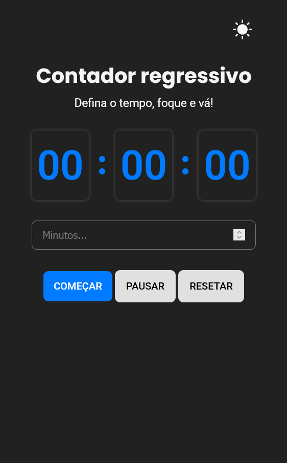

# ⏰ Contador regressivo
Um contador regressivo (timer) básico com **HTML**, **CSS** e **JavaScript** puros. Desenvolvido como exercício de manipulação do DOM, eventos, estados e boas práticas layout responsivo para projetos front-end.

--- 

## ✨ Funcionalidades
- ✅ Entrada de tempo (minutos)
- ✅ Botões: iniciar, pausar e resetar
- ✅ Mensagens que mudam conforme o estado do timer
- ✅ Layout responsivo (funciona bem em mobile e desktop)
- ✅ Atualização precisa a cada segundo

---

## 
## 📸 Prévia

> Clique para ver o contador funcionando:

🔗 [Projeto em produção](https://tatyane-goncalves.github.io/simple-calculator/)




---

## 🛠️ Tecnologias 

- HTML5
- CSS3
- JavaScript (Vanilla) 

---

## 📂 Estrutura do Projeto

```bash
  📁 simple-countdown-timer
  ├── 📁 src
  │ ├── 📁 css
  │ │   └── style.css
  │ ├── 📁 js
  │ │   └── main.js
  │ └── 📁 screenshots
  │     ├── preview-desktop.png
  │     └── preview-mobile.png
  ├── index.html
  ├── README.md
  └── README-pt.md
```

---


## 🧪 Como Usar
1 - Clone o repositório:

```bash
git clone https://github.com/Tatyane-Goncalves/simple-countdown-timer.git
```
2 - Acesse a pasta do projeto:
```bash
cd simple-countdown-timer
```

3 -  Abra o arquivo ` index.html` no seu navegador 
> Simples assim! Nada de back-end, nada dependências.

---

## 🎯 Objetivo 
Este projeto foi feito para treinar habilidades básicas em `JavaScript`, como:
- Captura de eventos
- Atualização de estados em tempo real
- Manipulação do DOM
- Boas práticas de UX/UI para aplicações simples


---

## 👩‍💻 Autor 
Feito com 💜 por Tatyane Gonçalves