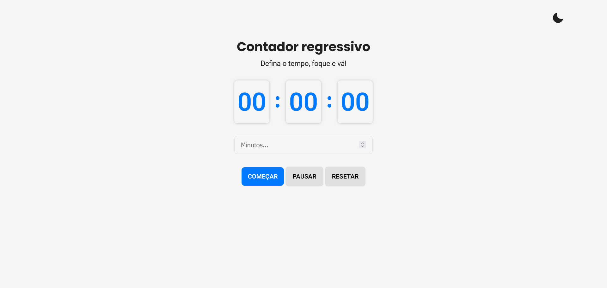
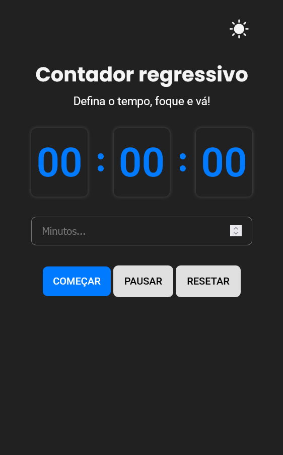

# ⏰ Countdown Timer

A simple countdown timer built with HTML, CSS, and Vanilla JavaScript. Created as a practice project to improve DOM manipulation, event handling, state updates, and responsive layouts for front-end development.

---

## ✨ Features

- ✅ Input for minutes
- ✅ Input for minutes 
- ✅ Dynamic messages based on the timer state
- ✅ Responsive layout (mobile and desktop)
- ✅ Accurate countdown updated every second

---

## 📸 Preview

> Click the link below to see it live:


🔗 [Live Demo](https://tatyane-goncalves.github.io/simple-countdown-timer/)




---

## 🛠️ Technologies

- HTML5
- CSS3
- Vanilla JavaScript  
---

## 📂 Project Structure

```bash
  📁 simple-countdown-timer
  ├── 📁 src
  │ ├── 📁 styles
  │ │   └── style.css
  │ ├── 📁 scripts
  │ │   └── main.js
  │ └── 📁 screenshots
  │     ├── preview-desktop.png
  │     └── preview-mobile.png
  ├── index.html
  ├── README.md
  └── README-pt.md
```

---


## 🧪 How to Use
1 - Clone the repository:
```bash
git clone https://github.com/Tatyane-Goncalves/simple-countdown-timer.git
```

2 - Navigate into the project folder:
```bash
cd simple-countdown-timer
```

3 - Open the `index.html` file in your browser
> That's it! No back-end, no dependencies!

---

## 🎯 Objective

This project aims to practice basic `JavaScript` skills such as:
- Event handling
- Real-time state updates
- DOM manipulation
- Good UX/UI practices for simple apps

---

## 👩‍💻 Author
Made with 💜 by Tatyane Gonçalves